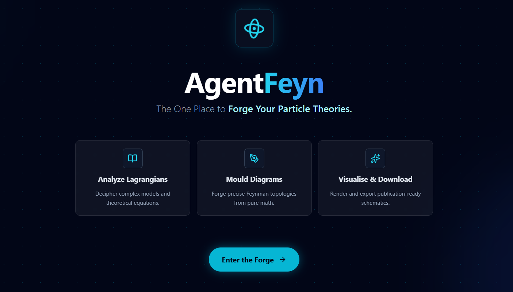
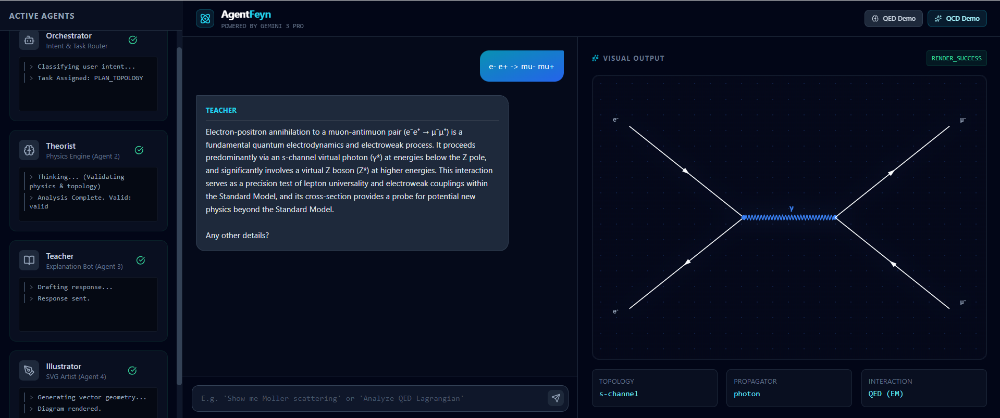

# Run and deploy your AI Studio app

This contains everything you need to run your app locally.

## Run Locally

**Prerequisites:**  Node.js

1. Install dependencies:
   `npm install`
2. Set the `GEMINI_API_KEY` in [.env.local](.env.local) to your Gemini API key
3. Run the app:
   `npm run dev`

## AgentFeyn: The One Place to Forge Your Particle Theories!

## The Problem

Theoretical physics workflows are fragmented.

- Computational tools like **FeynCalc** require complex coding skills (Mathematica) and don't intuitively *draw* for you.  
- Conversely, vector drawing web tools are manual and lack physics awareness, allowing users to draw invalid processes.  
- Even advanced LLMs can explain a Lagrangian but fail to construct the corresponding geometric topology, leaving a gap between mathematical intuition and visual representation.

## The Solution

**AgentFeyn** bridges this gap. Powered by **Gemini 3 Pro**, this AI *Physics Forge* turns raw LaTeX/textual Lagrangians and natural language into precise, publication-ready Feynman diagrams.

It orchestrates a specialized multi-agent system:

- **Theorist & Orchestrator**: Parse math and validate conservation laws (e.g., charge, lepton number) before drawing.  
- **Illustrator**: Automates vector geometry, rendering mathematically accurate SVG/PNGs. You can download these images as a PNG file directly to your local system.
- **Teacher**: Acts as an intelligent copilot, providing context-aware explanations and allowing researchers to refine ideas and the forged diagrams.

## Impact

AgentFeyn solves the **“blank canvas”** problem. By automating the translation of abstract math into geometry, it democratizes access to high-level physics visualization.

It turns a tedious manual chore—drawing complex decays like \( t \to bW^+ \) or VBF Higgs production—into an instant, intelligent discovery process where users can forge, analyze, and download their theories.

## Future Directions

We aim to evolve AgentFeyn into a **full-stack phenomenology workstation**. Future updates will introduce:

- Agentic tool use for **Monte Carlo event generation** (calculating cross-sections).  
- Automated data analysis for **kinematic histograms**.  
- An upgraded rendering engine to support **recursive topologies** for visualizing complex cascading decays.
